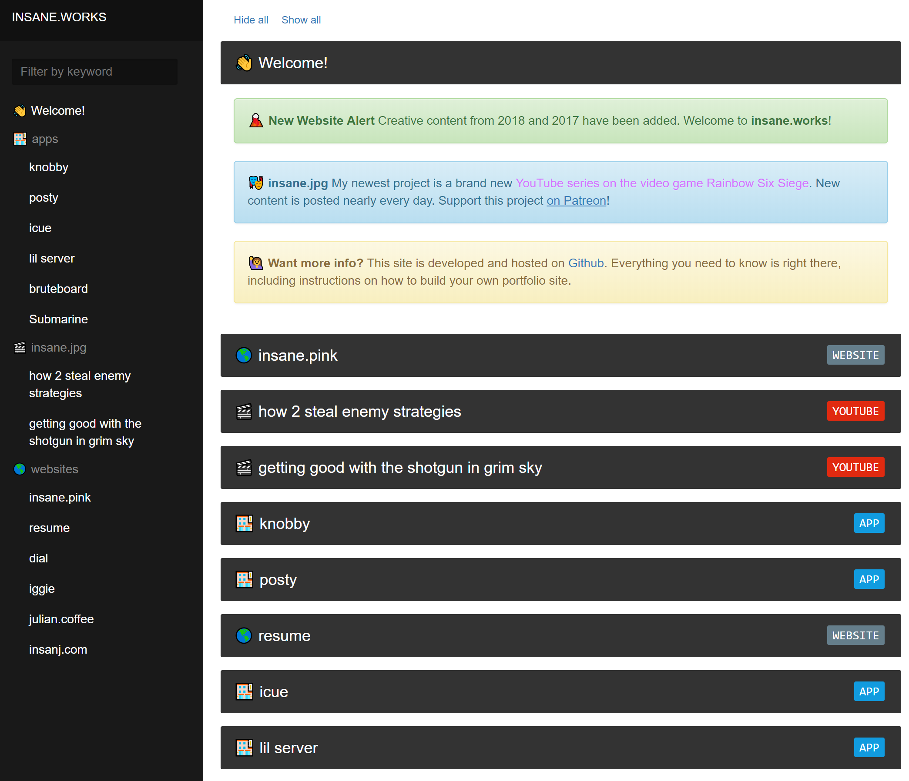

<h1 align="center">works</h1>
<h3 align="center">🐛 collected creative works by insanj & friends</h3>
<h4 align="center"><a href="https://insane.works">hosted on https://insane.works</a></h4>



# Usage

- Install [Jekyll](https://jekyllrb.com/)
- Run `jekyll serve --watch` or `jekyll build --destination docs`
- Open `localhost:4000` or `works/docs/index.html` to check out the site

> NOTE: works is based on the [Carte Jekyll Theme](https://github.com/Wiredcraft/carte) under the [MIT License](https://github.com/Wiredcraft/carte/blob/gh-pages/LICENSE.md), which is locally available in the [carte-LICENSE.md](carte-LICENSE.md) file

> I found this article helpful for setting up on an M1 machine https://www.earthinversion.com/blogging/how-to-install-jekyll-on-appple-m1-macbook/

# Authors

```
Julian @insanj Weiss
github.com/insanj
julian@oogycanyouhelp.com
(c) 2022
```

[Julian Weiss (insanj)](https://insanj.com). [@insanj](https://github.com/insanj). https://insanj.works.

# License

- "works" is licensed under gpl-3.0
- "insanj.works" live site is copyright (c) 2018
- "carte-jekyll" is licensed under mit

[see LICENSE](LICENSE)
