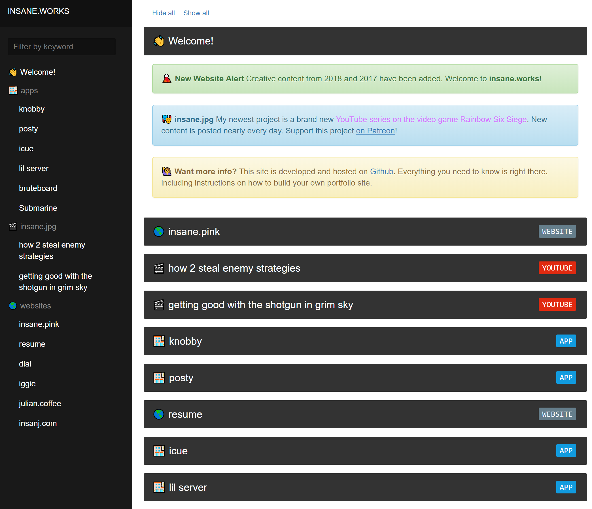

<h1 align="center">works</h1>
<h3 align="center">🐛 collected creative works by insanj & friends</h3>
<h4 align="center"><a href="https://insane.works">hosted on https://insane.works</a></h4>



## Install

1. Install [Jekyll](https://jekyllrb.com/)
2. 🍻 Enjoy!

> NOTE: works is based on the [Carte Jekyll Theme](https://github.com/Wiredcraft/carte) under the [MIT License](https://github.com/Wiredcraft/carte/blob/gh-pages/LICENSE.md), which is locally available in the [carte-LICENSE.md](carte-LICENSE.md) file

> NOTE: to install [make](https://www.gnu.org/software/make/) on Windows, `choco install make` is the easiest way with [Chocolatey](https://chocolatey.org/)

### M1 Mac

1. Install [brew](https://brew.sh/)
2. Install [rbenv](https://github.com/rbenv/rbenv) `brew install rbenv ruby-build`
3. Install a support Ruby version, at this time `3.0.0` was OK, `rbenv install 3.0.0`
4. Use that Ruby version globally `rbenv global 3.0.0`
5. Reinstall `jekyll`, with `bundler` and `webrick` to be sure: `gem install jekyll bundler webrick`
6. 🥁 Ready to go!

## Usage

1. Run `jekyll serve --watch` or `jekyll build --destination docs`
2. Open `localhost:4000` or `works/docs/index.html` to check out the site
3. ✨ Tada!

# Authors

```
Julian @insanj Weiss
github.com/insanj
julian@oogycanyouhelp.com
(c) 2022
```

[Julian Weiss (insanj)](https://insanj.com). [@insanj](https://github.com/insanj). https://insanj.works.

# License

- "works" is licensed under gpl-3.0
- "insanj.works" live site is copyright (c) 2018
- "carte-jekyll" is licensed under mit

[see LICENSE](LICENSE)
